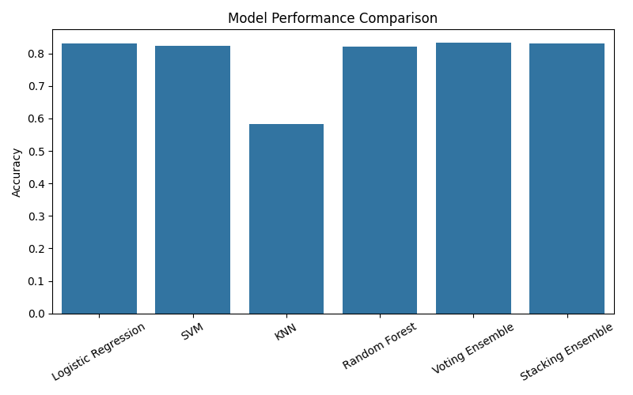

# 📰 Fake News Detection App

A **supervised Machine Learning project** that predicts whether a given news article is **Fake** or **Real**.
Built with **Next.js (TypeScript)**, **TailwindCSS**, and a **Flask (Python) backend** for ML inference.

---

## ⚡ Features

* 🔹 Detects **Fake vs Real** news in real-time.
* 🔹 Modern, responsive **Next.js frontend** styled with TailwindCSS.
* 🔹 **Text preprocessing pipeline** (lowercasing, punctuation removal, stopword removal, stemming).
* 🔹 Multiple trained ML models compared: **Logistic Regression, SVM, KNN, Random Forest, Ensemble models**.
* 🔹 Returns **prediction label** (Fake/Real) and **confidence score**.
* 🔹 REST API endpoint `/predict` for easy integration.

---

## 🛠️ Tech Stack

### Frontend

* [Next.js (TypeScript)](https://nextjs.org/)
* [TailwindCSS](https://tailwindcss.com/)

### Backend

* [Python](https://www.python.org/)
* [Flask](https://flask.palletsprojects.com/)
* [scikit-learn](https://scikit-learn.org/) for ML model training

### ML/NLP

* Text Normalization (lowercasing, punctuation removal)
* Tokenization & Stopword Removal
* Stemming (Porter Stemmer)
* TF-IDF Vectorization
* Models trained: Logistic Regression, SVM, KNN, Random Forest, Ensemble

---

## 📊 Model Performance Comparison

| Model                  | Accuracy   | Precision (avg) | Recall (avg) | F1-Score (avg) |
| ---------------------- | ---------- | --------------- | ------------ | -------------- |
| Logistic Regression    | 0.8310     | 0.83            | 0.83         | 0.83           |
| SVM (Linear)           | 0.8227     | 0.82            | 0.82         | 0.82           |
| KNN                    | 0.5817     | 0.60            | 0.59         | 0.57           |
| Random Forest          | 0.8211     | 0.82            | 0.82         | 0.82           |
| Stacking Ensemble      | 0.8297     | \~0.83          | \~0.83       | \~0.83         |
| **Voting Ensemble 🏆** | **0.8322** | **0.83**        | **0.83**     | **0.83**       |

📊 See bar chart comparison:



---

## 🚀 Getting Started

### 1. Clone the repository

```bash
git clone https://github.com/yourusername/fake-news-detection.git
cd fake-news-detection
```

### 2. Install dependencies

**Frontend** (Next.js):

```bash
cd frontend
npm install
npm run dev
```

**Backend** (Flask + Python ML API):

```bash
cd backend
pip install -r requirements.txt
python app.py
```

---

## 📊 Model Training

* Dataset: [Fake News Dataset](https://www.kaggle.com/c/fake-news/data)
* Models trained: Logistic Regression, Random Forest, SVM, KNN, Ensemble
* Vectorization: **TF-IDF**
* Evaluation Metrics: **Accuracy, Precision, Recall, F1-score**

---

## 🎯 Usage

1. Start the backend (`python app.py`) → runs on **[http://localhost:5000](http://localhost:5000)**.
2. Start the frontend (`npm run dev`) → runs on **[http://localhost:3000](http://localhost:3000)**.
3. Enter/paste news article text in the frontend app.
4. Receive **Fake/Real** prediction + **confidence score** instantly.

---

## 📂 Project Structure

```
fake-news-detection/
│── frontend/        # Next.js + Tailwind frontend
│── backend/         # Flask ML backend (app.py, models, preprocessing)
│── model_comparison.png   # Bar chart of model comparison
│── README.md
```

---

## 🤝 Contributing

Pull requests are welcome! For major changes, please open an issue to discuss first.

---

## 📜 License

This project is licensed under the **MIT License**.

---
